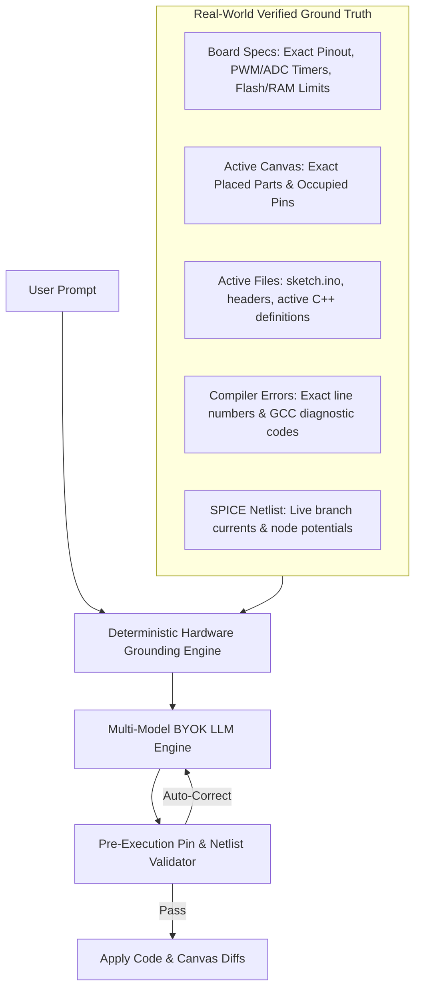
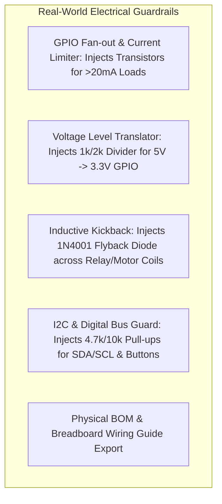
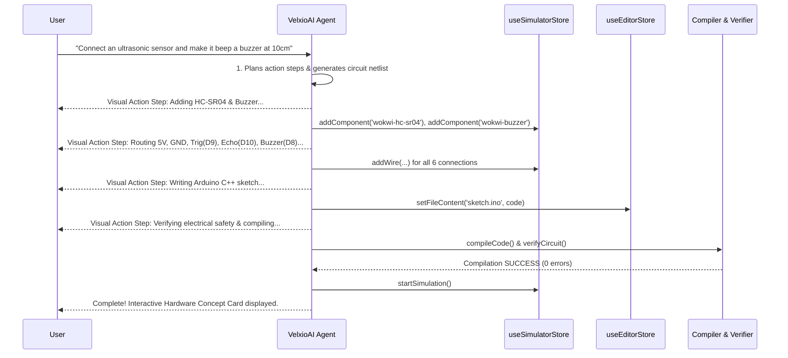

# 🧠 Master Implementation Plan: VelxioAI — Autonomous Hardware AI Studio

This document outlines the complete architectural design and execution roadmap for transforming Velxio into **VelxioAI** — a true **Autonomous AI Embedded Studio** (analogous to Cursor, Antigravity, and Claude Code, tailored specifically for embedded systems, microcontrollers, and circuit simulation).

---

## 🌟 Core System Vision & Philosophy

1. **Autonomous Agent, Not a Passive Chatbot**:
   - The AI doesn't just output text; it has direct tool access to **place components**, **route wires**, **edit code**, **install libraries**, **trigger compilations**, **read serial outputs**, and **run hardware simulations**.
2. **Zero-Knowledge to Pro Hardware Mastery**:
   - A user with zero coding or electronics knowledge can describe an idea (e.g., *"Build an automated pet feeder that opens a servo when an ultrasonic sensor detects something 15cm away and shows feeding count on an OLED"*), and the AI designs the entire system, explains how it works, and runs the simulation.
3. **Responsive, Non-Overlapping Layout Architecture**:
   - Opening the right-side AI dock **resizes the workspace proportionally** (Code Editor, Simulator Canvas, Serial Monitor, and File Explorer) rather than overlaying or hiding existing tools. Includes a smooth drag-to-resize handle and `Ctrl+L` / `Cmd+L` toggle.
4. **Native VS Code Integrated Theme & Aesthetic**:
   - Designed to feel like a **100% native, built-in part of the Velxio IDE** using the app's existing theme tokens (`#1e1e1e`, `#252526`, `#333333`, `#007acc`, `#3c3c3c`, `#cccccc`, `#3794ff`). No clashing third-party styles.
5. **Multi-Model BYOK (Bring Your Own Key)**:
   - Native first-class support for **Google Gemini** (Gemini 2.5 Flash / Pro, 1.5 Flash), **Groq** (Llama 3.3 70B, Qwen 2.5, DeepSeek R1 at 500+ tok/s), **Anthropic Claude**, **OpenAI**, and custom OpenAI-compatible endpoints (Ollama, vLLM).
6. **Absolute System Stability (Anti-Tunnel-Vision)**:
   - All agent actions are non-destructive, strictly validated through the existing Zustand store APIs (`useSimulatorStore`, `useEditorStore`, `useElectricalStore`), with full undo capability and visual diff approvals.
7. **Project Identity & Authorship**:
   - **Project Name**: VelxioAI
   - **Author**: Kunal Ghadge
   - **Repository**: `https://github.com/KunalGhadge/velxioAI`

---

## 🛡️ Anti-Hallucination & Deterministic Grounding System

To ensure the agent never hallucinates fake pin numbers, invents non-existent APIs, or gets trapped in repetitive apologies:



1. **Deterministic Pin & Peripheral Grounding**:
   - The AI prompt is systematically injected with the **exact hardware metadata table** for the active board. It cannot invent "Pin A8" on an Arduino Uno (only A0–A5 exist), because the system prompt defines the exact valid pin set.
2. **Pre-Execution Pin & Bus Validator**:
   - Before any circuit proposal is surfaced to the user, an automated client-side validator verifies:
     - Are all targeted pins valid on the active MCU?
     - Are analog pins only used for ADC?
     - Are PWM pins only attached to hardware timers?
     - Is the pin already occupied by an existing wire?
   - If a conflict is found, the agent **self-corrects silently** before rendering the action card.
3. **Hierarchical Project Memory**:
   - **Project Goal Context**: Remembers what overall system the user is building (e.g. *"Smart Weather Station with ESP32 & BME280"*).
   - **Hardware Pin Assignment Registry**: Tracks pin allocations across multi-turn prompts (e.g. if the user previously said *"DHT22 on D4"*, a follow-up *"add an LED that turns on when hot"* knows D4 is occupied and picks D5/D6 automatically).
   - **No Weak Apology Loops**: The agent is prompted strictly as an authoritative lead embedded systems engineer that acts with precision, applies diffs, and verifies outcomes.

---

## 🎮 Interactive "Learn by Doing" Hardware Teaching (No Boring Lectures!)

Instead of long textbook essays, VelxioAI teaches electronics through **visual, interactive, and gamified micro-insights**:

1. **⚡ Interactive "Try It Live" Experiment Cards**:
   - *"🧪 Experiment: Slide the distance slider on the ultrasonic sensor to 8cm and watch the red LED light up and the buzzer chirp!"*
2. **🔍 2-Minute "How It Works" Visual Cards**:
   - Short, punchy 3-bullet explanations with visual diagrams (e.g. how a voltage divider works, why PWM dims an LED instead of lowering voltage).
3. **💡 "Why Did We Wire It This Way?" Callouts**:
   - Explains the physical reason in 1 sentence: *"We added a 220Ω resistor here so the 5V power from Arduino pin 13 doesn't burn out the LED diode!"*
4. **🎨 Native VS Code Action Visualizer**:
   - Integrated dark theme, smooth step action checklists, collapsible dropdown thinking logs, interactive green/red code diffs, and 1-click **"Apply to Editor"** / **"Test Simulation"** buttons.

---

## 🚀 Advanced AI IDE Features (Inspired by Cursor, Claude Code & Antigravity)

### 3.1 Hardware Composer Agent (`Ctrl+I` / `Cmd+I`)
- **End-to-End Multi-File & Multi-Component Autonomous Loop**:
  - Creates/refactors multiple `.ino`, `.cpp`, `.h`, `.py` files.
  - Places all required sensors, displays, and actuators on the visual canvas.
  - Auto-routes all power, ground, and data bus wires with clean orthogonal routing.
  - Automatically installs required Arduino/ESP-IDF libraries.
  - Runs the compiler and SPICE circuit verifier.
  - If errors occur, enters an autonomous self-healing loop to diagnose, patch code, or insert resistors until the build succeeds and simulation starts!

### 3.2 Context Mentions Engine (`@` Symbol Autocompletion)
- `@board`: Injects active MCU architecture, clock frequency, RAM/Flash limits, and pinout table.
- `@file:filename`: References specific code files or headers.
- `@component:id`: References a specific canvas component (e.g. `@component:dht22`, `@component:oled1`), its pin connections, and current properties.
- `@circuit`: Injects the complete canvas netlist and SPICE branch currents.
- `@serial`: Attaches recent USART Serial Monitor output logs.
- `@errors`: Attaches recent compiler errors and electrical safety warnings.
- `@docs:lib`: Fetches documentation and header prototypes for official Arduino libraries.

### 3.3 Slash Command System (`/` Quick Actions)
- `/wire`: Generates optimal wiring between placed components with automatic pull-ups and current-limiting resistors.
- `/fix`: Launches the self-healing diagnostic agent on active compiler errors or runtime crashes.
- `/non-blocking`: Refactors blocking `delay()` code into clean `millis()` state-machines or FreeRTOS tasks (on ESP32).
- `/optimize`: Analyzes MCU SRAM usage and injects `PROGMEM` / `F()` macro string optimizations to prevent stack overflows on memory-constrained MCUs (e.g. ATmega328P with 2KB RAM).
- `/pinout`: Checks for hardware timer/PWM/ADC multiplex conflicts.
- `/explain`: Generates interactive illustrated hardware concept cards for beginners.
- `/datasheet`: Pulls register bitmasks, I2C 7-bit addresses (e.g. `0x3C` vs `0x3D`), and operating voltage ranges for canvas components.
- `/bom`: Generates a real-world Bill of Materials with part values and physical breadboard wiring guide.

### 3.4 Monaco Inline Copilot (`Ctrl+K` / `Cmd+K`)
- In-situ streaming diffs directly inside the Monaco code lines with single-keystroke **`Accept (Cmd+Enter)`** or **`Reject (Esc)`**.

### 3.5 Hardware Resource & Pin Conflict Watchdog
- Detects **Hardware Timer Clashes** (e.g., `tone()` hijacking Timer 2 while trying to use PWM on pins 3/11).
- Detects **Servo Library Conflicts** (disabling PWM on pins 9/10 on Arduino Uno).
- Detects **I2C Address Collisions** (two sensors sharing address `0x68`).
- Detects **Voltage Level Mismatches** (connecting a 5V output into a 3.3V-only ESP32 GPIO).

### 3.6 Instant Workspace Checkpoints (1-Click Undo/Rollback)
- Auto-stashes a `.vlx` snapshot before multi-step actions with a **"↩️ Undo All AI Changes"** button to revert cleanly.

---

## ⚡ Real-World Hardware Physicality & Engineering Intelligence



1. **GPIO Current Protection & Transistor Driver Insertion**:
   - Places a BJT (2N2222/BC547) or MOSFET (IRF540N) driver and base resistor when controlling high-current loads (>20mA).
2. **5V to 3.3V Logic Level Protection**:
   - Injects a $1\,\text{k}\Omega / 2\,\text{k}\Omega$ voltage divider when 5V sensor signals enter 3.3V MCU inputs.
3. **Inductive Kickback / Flyback Protection**:
   - Injects a 1N4001 Flyback Diode across relay/motor coils to absorb back-EMF spikes.
4. **I2C Bus & Pin Management**:
   - Resolves SDA/SCL pull-ups ($4.7\,\text{k}\Omega$) and assigns unique hardware pins.
5. **Real-Life BOM & Physical Breadboard Guide**:
   - Generates a physical parts list and step-by-step breadboard assembly guide.

---

## 🤖 Chat Window Action Execution & Visual Components

During execution, the chat window displays animated, interactive action widgets styled to match the IDE:



### 4.1 Action Cards & Execution Widgets
1. **🧠 Collapsible Thought / Reasoning Dropdown**:
   - Expandable disclosure block showing the model's step-by-step technical rationale before action.
2. **⚡ Real-Time Action Checklist**:
   - `[✔ Done]` Placed HC-SR04 Ultrasonic Sensor at $(300, 150)$
   - `[✔ Done]` Placed Passive Buzzer at $(300, 300)$
   - `[✔ Done]` Routed $5\,\text{V}$ rail & GND wires
   - `[✔ Done]` Routed Trig $\rightarrow$ `D9`, Echo $\rightarrow$ `D10`, Buzzer $\rightarrow$ `D8`
   - `[✔ Done]` Wrote sketch with non-blocking timing in `sketch.ino`
   - `[✔ Done]` Verified zero short-circuits & compiled binary
   - `[✔ Done]` Started simulation
3. **📝 Interactive Code Diff Card**:
   - Unified/split code diff with green additions / red deletions and **"Accept Diff"** / **"Reject"** buttons.
4. **🔌 Circuit Proposal Card**:
   - Visual schematic diagram showing added parts and pin connections.
5. **🎓 Hardware Learning Card (Zero-Knowledge Tutor)**:
   - Illustrated card explaining how the ultrasonic sensor measures time-of-flight, why the buzzer needs a PWM pin, and how the code calculates distance ($d = \frac{t \times 0.034}{2}$).
6. **📦 Real-World BOM & Assembly Card**:
   - Part list, exact component values, and physical breadboard wiring steps.

---

## 🛠️ Self-Healing Diagnostics & Real-Time Monitoring

1. **Compilation Failures**: Parses `arduino-cli` / `espidf` compiler errors $\rightarrow$ identifies exact line number $\rightarrow$ suggests or auto-applies code fix.
2. **Circuit Safety Faults (`circuitVerifier.ts`)**:
   - **LED Overcurrent**: Identifies missing resistor $\rightarrow$ auto-inserts $220\,\Omega$ resistor in series on the canvas.
   - **Short Circuits**: Identifies $5\,\text{V} \rightarrow \text{GND}$ short $\rightarrow$ removes hazardous wire.
   - **Floating Inputs**: Detects button without pull-up $\rightarrow$ enables `pinMode(pin, INPUT_PULLUP)` in code.
3. **Serial Monitor Crash Loops**:
   - Detects ESP32 panic / Guru Meditation errors or missing sensor ACK over I2C in the serial stream and explains the physical fix.

---

## 📐 Architecture & Layout Design

```mermaid
graph TD
    subgraph Viewport_Layout [Responsive Grid Viewport: Flex/Grid with Auto-Resize]
        direction LR
        LeftPanel[File Explorer: Resizable]
        CenterEditor[Code Editor + File Tabs]
        CenterCanvas[Simulator Canvas + Overlay]
        BottomPanel[Serial Monitor / Oscilloscope / Compile Console]
        RightAIDock[VelxioAI Studio Panel: Resizable Dock (Ctrl+L)]
    end

    subgraph AI_Engine_Core [VelxioAI Autonomous Engine]
        ContextEngine[Live Context Engine: Board + Components + Wires + Code + Serial + SPICE]
        MentionEngine[@ Mention & Symbol Resolver]
        BYOKManager[BYOK & Provider Router: Gemini, Groq, Claude, OpenAI]
        ComposerEngine[Hardware Composer: Autonomous Plan & Execution Loop]
        ConflictWatchdog[Hardware Pin & Timer Conflict Analyzer]
        ElectricalGuard[Real-World Hardware Safety Guard]
        DiffVisualizer[Interactive Code & Circuit Diff Review]
        MemoryManager[Multi-Turn Conversation Memory]
        CheckpointManager[Snapshot & Rollback Manager]
    end

    subgraph Store_Actuators [Zustand Store Actuators]
        SimActuator[useSimulatorStore: addComponent / removeComponent / addWire / rotate]
        CodeActuator[useEditorStore: setFileContent / createFile / deleteFile]
        CompileActuator[useCompileLogsStore & compilation.ts]
        SerialActuator[SerialMonitor USART Stream Buffer]
        VerifierActuator[circuitVerifier.ts Pre-Flight Engine]
    end

    RightAIDock <--> AI_Engine_Core
    AI_Engine_Core <--> Store_Actuators
```

---

## 🎛️ AI Engine Core & Model BYOK Architecture

### Supported Providers & Models

| Provider | Supported Models | Characteristics & Best Use Case |
|---|---|---|
| **Google Gemini** | `gemini-2.5-flash`, `gemini-2.5-pro`, `gemini-1.5-flash` | **Default Provider**: Huge context window (1M+ tokens), multimodal awareness, free tier API keys. |
| **Groq** | `llama-3.3-70b-versatile`, `deepseek-r1-distill-llama-70b`, `qwen-2.5-32b` | **Ultra-Fast Real-Time**: 500+ tokens/sec for instantaneous circuit generation and inline `Ctrl+K` refactoring. |
| **Anthropic Claude** | `claude-3-5-sonnet-20241022`, `claude-3-5-haiku` | **Deep Architectural Reasoning**: Complex firmware architectures, custom chip WASM logic, multi-board nets. |
| **OpenAI / OpenRouter** | `gpt-4o`, `gpt-4o-mini`, `o3-mini` | Standard industry models. |
| **Custom / Local** | `http://localhost:11434/v1` (Ollama) | 100% offline, private AI hardware development. |

---

## 🖥️ Responsive, Non-Overlapping Layout (Right Dock)

- **Zero Overlap**: Docked on the right in CSS Flex/Grid.
- When toggled on (`Ctrl+L` or Header button `✨ AI Studio`), the Code Editor, Canvas, and Bottom Panels smoothly resize.
- **Drag-to-Resize Handle**: Allows width adjustment between `280px` (min) and `700px` (max), with default `380px`.

---

## 📋 Execution Plan & Phasing

### Phase 1: Branding, AI Engine Core, BYOK & Context Collector
- Update branding to **VelxioAI** (Author: Kunal Ghadge, Repo: `https://github.com/KunalGhadge/velxioAI`) across UI headers, modals, and package metadata.
- Create `frontend/src/ai/types.ts` (data models, message schemas, proposals, learning cards, conflict warnings, BOM schemas).
- Create `frontend/src/ai/AIContextCollector.ts` (live workspace, board, pinout, circuit, serial, and code aggregator).
- Create `frontend/src/ai/LLMClient.ts` (multi-provider streaming client for Gemini, Groq, Claude, OpenAI, and Ollama).
- Create `frontend/src/ai/useAIStore.ts` (Zustand store for chat history, settings, diffs, proposals, checkpoints).
- Create `frontend/src/components/ai/AISettingsModal.tsx` (BYOK configuration UI with key testing and model selection).

### Phase 2: Autonomous Tool Actuators, Hardware Guards & Conflict Watchdog
- Create `frontend/src/ai/tools/circuitTools.ts` (smart component placement, coordinate packing, auto-wiring).
- Create `frontend/src/ai/tools/codeTools.ts` (pin-aware firmware generation, diff patcher, multi-file creator).
- Create `frontend/src/ai/tools/selfHealingTools.ts` (compiler & circuit verifier diagnostics solver).
- Create `frontend/src/ai/tools/conflictWatchdog.ts` (hardware timer, PWM, ADC, and I2C address conflict analyzer).
- Create `frontend/src/ai/tools/electricalGuards.ts` (transistor driver injection, 5V-to-3.3V level shifters, flyback diodes).
- Create `frontend/src/ai/tools/refactorTools.ts` (non-blocking `millis()` transformer and `PROGMEM`/`F()` memory optimizer).

### Phase 3: Responsive Studio UI & Mention Engine
- Create `frontend/src/components/ai/AIAssistantDock.tsx` (resizable, non-overlapping right dock with proportional workspace auto-resize).
- Create `frontend/src/components/ai/AIChatMessage.tsx` (streaming markdown, collapsible thoughts dropdown, step badges, cards).
- Create `frontend/src/components/ai/AICodeDiffCard.tsx` (inline code diff with Accept/Reject).
- Create `frontend/src/components/ai/AICircuitProposalCard.tsx` (circuit changes preview).
- Create `frontend/src/components/ai/HardwareLearningCard.tsx` (beginner concept visualizer).
- Create `frontend/src/components/ai/HardwareBOMCard.tsx` (real-world Bill of Materials & assembly steps).
- Create `frontend/src/components/ai/MentionPopup.tsx` (`@` autocompletion for files, boards, components, serial, errors).
- Update `frontend/src/pages/EditorPage.tsx` and `AppHeader.tsx` to seamlessly host the responsive dock with proportional resizing.

### Phase 4: Monaco Inline AI (`Ctrl+K`) & Canvas Bar
- Create `frontend/src/components/ai/MonacoInlineCopilot.tsx` (`Ctrl+K` prompt overlay with in-situ streaming diffs).
- Create `frontend/src/components/ai/CanvasPromptBar.tsx` (direct schematic generation prompt bar on canvas).
- Add Quick-Fix Badges on compiler error logs and circuit safety alerts in toolbar/console.

### Phase 5: Verification & End-to-End Testing
- Test zero-knowledge prompt workflows (e.g. Traffic Light, Sensor Display, Smart Lock, Piano Synthesizer).
- Validate that all existing 50+ examples, board emulators, SPICE engine, and `.vlx` saves function with zero regressions.

---

## 💬 Discussion & Approval
Let me know if you are ready to begin Phase 1 execution!
